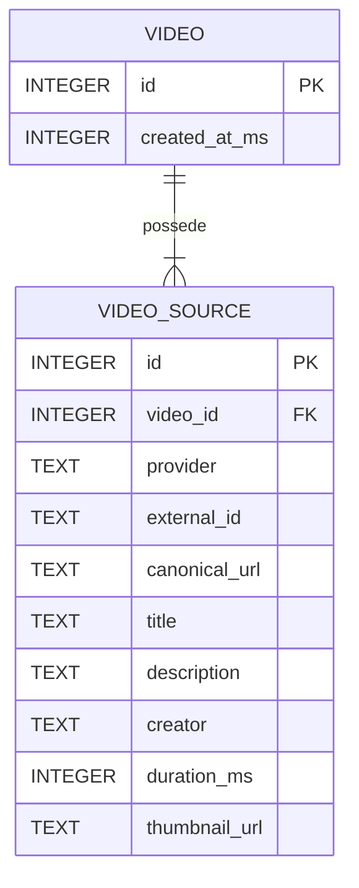

# Sillage

**Sillage** est une base de connaissances personnelle centrée sur la vidéo.
L'objectif est de transformer le visionnage d'une vidéo en connaissance durable, structurée et réutilisable : métadonnées, notes Markdown, timestamps, annotations, transcriptions, tags, captures, recherche et enrichissements IA.

> Le projet est en développement actif. Les premières tranches — extraction des métadonnées YouTube et persistance SQLite — sont fonctionnelles.

## Vision

Une vidéo est un flux temporel continu. Pendant son visionnage, certaines idées, explications, images ou passages méritent d'être conservés et retrouvés plus tard.
Sillage vise à réunir ces éléments autour d'un objet `Video` stable :

```text
vidéo
  ↓
visionnage
  ↓
notes + timestamps + annotations + captures
  ↓
transcription + tags
  ↓
recherche et structuration
  ↓
connaissance exploitable
```

YouTube est la première source prise en charge, mais le modèle n'est pas limité à une plateforme particulière.

Une `Video` représente un objet de connaissance interne à Sillage. Une vidéo YouTube, un fichier local ou une autre plateforme ne sont que des sources ou représentations de cet objet.

## État actuel

Le flux persistant suivant est implémenté :

```text
URL YouTube
    ↓
AddVideo
    ↓
adapter yt-dlp
    ↓
Video + VideoSource
    ↓
SQLite
    ↓
relecture persistante
```

Sillage sait actuellement :

* recevoir une URL YouTube ;
* appeler `yt-dlp` ;
* extraire et normaliser les métadonnées utiles ;
* créer une `Video` et sa `VideoSource` ;
* les persister dans SQLite ;
* retrouver une vidéo existante à partir de l'identité de sa source ;
* conserver la même `Video` pour plusieurs formes d'URL correspondant à la même vidéo YouTube.

Une `Video` et ses `VideoSource` possèdent leurs propres identifiants internes Sillage.

L'identité externe d'une source repose, lorsqu'un identifiant externe existe, sur le couple :

```text
(provider, external_id)
```

Pour YouTube, deux URL telles que :

```text
https://youtu.be/IgKU8xCgbjc
https://www.youtube.com/watch?v=IgKU8xCgbjc
```

sont normalisées vers la même identité externe et retournent donc la même `Video`.

Les métadonnées d'une source déjà enregistrée ne sont pas rafraîchies implicitement par `AddVideo`.

### Flux actuel d'ajout d'une vidéo

```mermaid
flowchart TD
    URL["URL YouTube"] --> AddVideo["Service.AddVideo"]

    AddVideo --> Extract["MetadataProvider.Extract"]
    Extract --> Normalize["VideoSource normalisée"]

    Normalize --> Find["VideoRepository.FindBySource"]

    Find -->|trouvée| Existing["Retourner la Video existante"]

    Find -->|absente| Create["VideoRepository.Create"]
    Create --> Transaction["Transaction SQLite"]
    Transaction --> InsertVideo["INSERT videos"]
    InsertVideo --> InsertSource["INSERT video_sources"]
    InsertSource --> Commit["COMMIT"]
    Commit --> Created["Retourner la Video créée"]

    Existing --> JSON["Encodage JSON"]
    Created --> JSON
    JSON --> Stdout["stdout"]
````

La contrainte SQL sur `(provider, external_id)` reste la garantie ultime contre la création concurrente de doublons.

## Architecture actuelle

Le cœur applicatif dépend de **ports**, et non directement des technologies utilisées.

```mermaid
flowchart TB
    CLI["CLI provisoire<br/>cmd/server"]
    Service["video.Service<br/>Application Service"]

    YtdlpAdapter["ytdlp.Client<br/>adapter MetadataProvider"]
    SQLiteAdapter["sqlite.VideoRepository<br/>adapter VideoRepository"]

    Ytdlp["yt-dlp"]
    SQLite["SQLite"]

    CLI --> Service

    Service -->|"MetadataProvider"| YtdlpAdapter
    Service -->|"VideoRepository"| SQLiteAdapter

    YtdlpAdapter --> Ytdlp
    SQLiteAdapter --> SQLite
```

> Le service applicatif dépend uniquement des ports `MetadataProvider` et `VideoRepository`. Leurs implémentations actuelles sont respectivement `ytdlp.Client` et `sqlite.VideoRepository` (adapters) ce qui maintient le cœur indépendant de `yt-dlp` et de SQLite.

`video.Service` orchestre les cas d'usage sans connaître les technologies utilisées.
Le raccordement est effectué au démarrage en injectant les implémentations concrètes dans `video.NewService`.

## Modèle de données actuel

La première tranche persistante ne contient volontairement que les entités nécessaires à l'ajout d'une vidéo.



`Video.id` et `VideoSource.id` sont des identifiants internes Sillage.

`VideoSource.external_id` appartient à l'espace de noms défini par son `provider`.

Lorsqu'un `external_id` existe :

```text
(provider, external_id)
```

est unique.

Le modèle métier prévoit plus tard d'autres objets tels que :

* `Transcript` ;
* `TranscriptSegment` ;
* `Note` ;
* `Annotation` ;
* `Tag` ;
* `Asset` ;
* `MediaFile`.

Ils ne sont volontairement pas représentés dans ce schéma, car ils ne sont pas encore persistés.

Le modèle conceptuel complet est documenté dans [`docs/02-domain-model.md`](docs/02-domain-model.md).

## Architecture cible

Les futures interfaces doivent utiliser le même cœur applicatif.

```mermaid
flowchart TD
    Web["Web UI"] --> REST["REST / Chi"]
    REST --> Services["Application Services"]

    MCP["MCP"] --> Services
    CLI["CLI"] --> Services
    Desktop["Futur desktop"] --> Services

    Services --> Ports["Ports"]
    Ports --> Adapters["Adapters"]

    Adapters --> SQLite["SQLite"]
    Adapters --> Ytdlp["yt-dlp"]
    Adapters --> Ffmpeg["ffmpeg"]
    Adapters --> Filesystem["Filesystem"]
    Adapters --> AI["IA"]
````

REST, MCP, le CLI et une éventuelle application desktop doivent appeler les mêmes services applicatifs.
Les interfaces externes et dépendances techniques restent des adapters autour du cœur.

## Fonctionnalités envisagées

### Bibliothèque vidéo

* ajout d'une vidéo depuis une URL ;
* récupération automatique des métadonnées ;
* navigation par miniatures ;
* tags et filtres ;
* recherche.

### Espace de travail vidéo

La page d'une vidéo doit devenir un véritable espace de travail :

* lecteur vidéo ;
* notes Markdown ;
* insertion rapide du timestamp courant ;
* navigation depuis un timestamp vers le passage correspondant ;
* annotations temporelles structurées ;
* consultation de la transcription ;
* captures d'écran liées à un timestamp.

Exemple de prise de notes :

```markdown
[12:42] Comparer cette approche avec le fonctionnement de SQLite.
```

La dimension temporelle est un élément métier de premier ordre : timestamps de notes, annotations, segments de transcription et captures doivent pouvoir être reliés précisément à la vidéo.

### Transcriptions

Pour YouTube, Sillage utilisera dans un premier temps `yt-dlp` afin de récupérer les sous-titres disponibles.

Le format `json3` sera normalisé vers le modèle interne :

```text
Transcript
└── TranscriptSegment
    ├── start_ms
    ├── end_ms
    └── text
```

Le format externe ne doit pas devenir le format métier de l'application.

### Recherche

La recherche doit à terme pouvoir couvrir :

* titres ;
* descriptions ;
* tags ;
* notes ;
* transcriptions ;
* résumés et autres artefacts textuels.

SQLite FTS5 est privilégié pour la future recherche plein texte.

Lorsqu'un résultat provient d'un contenu temporel, Sillage doit idéalement pouvoir ouvrir directement la vidéo au bon timestamp.

### IA et MCP

Sillage est conçu pour être **IA-native**, tout en restant pleinement utilisable sans IA.

Des agents pourront à terme interroger et modifier la base via MCP avec des outils métier tels que :

```text
search_videos
get_video
get_transcript
get_annotations
add_tags
append_note
```

Ils ne doivent pas être exposés à des primitives techniques telles que :

```text
execute_sql
run_ytdlp_command
```

Exemple d'usage :

> Recherche mes vidéos sur Proxmox et Tailscale et indique lesquelles parlent du subnet routing.

## Stack technique

Choix actuels ou privilégiés :

* **Go**
* `net/http`
* **Chi**
* **SQLite**
* `database/sql`
* `modernc.org/sqlite`
* migrations SQL embarquées avec `embed.FS`
* `PRAGMA user_version`
* SQLite **FTS5** à terme
* **yt-dlp**
* **ffmpeg**
* **Docker**
* API REST
* MCP en Go à terme

Le frontend n'est pas encore choisi.

Une version desktop reste envisageable, mais sa technologie n'est pas arrêtée.

## SQLite

La persistance actuelle utilise :

```text
database/sql
+
modernc.org/sqlite
```

Le schéma est initialisé automatiquement au démarrage à partir de migrations SQL embarquées.

Le système de migrations utilise :

```text
embed.FS
+
PRAGMA user_version
```

Les migrations sont :

* versionnées ;
* forward-only ;
* appliquées dans l'ordre ;
* transactionnelles.

La configuration actuelle active également :

```text
foreign_keys = ON
busy_timeout ≈ 5000 ms
```

Le mode WAL n'est pas activé pour l'instant.

## Exécution

### Prérequis

* Go 1.27.1 ;
* `yt-dlp` accessible dans le `PATH`.

Le programme dans `cmd/server` est actuellement une interface temporaire permettant de tester le flux persistant :

```bash
go run ./cmd/server \
  "https://www.youtube.com/watch?v=IgKU8xCgbjc" \
  ./sillage.db
```

Il affiche la `Video` normalisée en JSON.

Relancer la commande avec une autre URL représentant la même vidéo réutilise l'enregistrement existant dans `sillage.db`.

Exemple :

```bash
go run ./cmd/server \
  "https://youtu.be/IgKU8xCgbjc" \
  ./sillage.db
```

### Validation

```bash
go test ./...
go vet ./...
go build ./...
```

Les tests automatisés de parsing et de comportement de l'adapter `yt-dlp` ne nécessitent ni Internet ni un véritable processus `yt-dlp`. Les vérifications réelles avec YouTube et le binaire `yt-dlp` restent des tests d'intégration manuels.

Les tests SQLite couvrent notamment :

* migrations ;
* contraintes ;
* rollback ;
* persistance après réouverture ;
* identité externe ;
* idempotence ;
* créations concurrentes.

## Structure du projet

```text
.
├── cmd/
│   └── server/
│
├── internal/
│   ├── video/
│   │   ├── model.go
│   │   ├── repository.go
│   │   └── service.go
│   │
│   ├── adapter/
│   │   ├── sqlite/
│   │   │   └── migrations/
│   │   └── ytdlp/
│   │
│   ├── transcript/
│   └── http/
│
├── docs/
│
└── deployments/
    └── docker/
```

La structure continuera d'évoluer à partir des besoins réels plutôt que d'anticiper toutes les fonctionnalités futures.

## Documentation

La documentation détaillée de conception se trouve dans [`docs/`](docs/).

* [`00-project-brief.md`](docs/00-project-brief.md) — vision et périmètre ;
* [`01-product-and-ux.md`](docs/01-product-and-ux.md) — workflows et UX ;
* [`02-domain-model.md`](docs/02-domain-model.md) — modèle métier ;
* [`03-architecture.md`](docs/03-architecture.md) — architecture ;
* [`04-tech-stack-and-decisions.md`](docs/04-tech-stack-and-decisions.md) — choix techniques ;
* [`05-roadmap-and-open-questions.md`](docs/05-roadmap-and-open-questions.md) — roadmap et questions ouvertes.

Ces documents constituent la référence détaillée du projet.

## Roadmap

Le développement avance par petits incréments verticaux :

```text
yt-dlp
  ↓
modèle Go
  ↓
SQLite
  ↓
API REST
  ↓
transcriptions
  ↓
notes + tags
  ↓
UI minimale
  ↓
timestamps
  ↓
téléchargement + screenshots
  ↓
recherche
  ↓
MCP
  ↓
IA intégrée
```

### Terminé

* preuve de concept `yt-dlp` ;
* modèle initial `Video` / `VideoSource` ;
* identités internes Sillage ;
* persistance SQLite ;
* migrations ;
* `VideoRepository` ;
* service `AddVideo` ;
* idempotence par identité externe.

### Prochaine tranche

L'étape suivante prévue est une **API HTTP minimale** permettant notamment :

```text
POST /api/v1/videos
GET  /api/v1/videos
GET  /api/v1/videos/{id}
```

La sémantique exacte de cette API doit encore être précisée avant son implémentation.

## Principes de développement

Le projet privilégie :

* la simplicité ;
* le code Go idiomatique ;
* les petits incréments verticaux testables ;
* les abstractions justifiées par un besoin réel ;
* une séparation claire entre domaine, services et adapters ;
* une architecture modulaire sans surarchitecture ;
* une approche local-first ;
* un produit pleinement utilisable sans IA.
