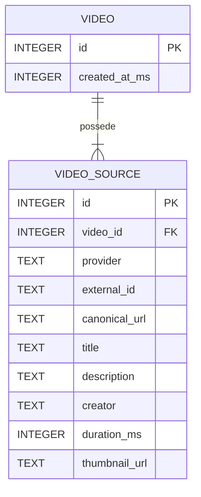

# Sillage

**Sillage** est une base de connaissances personnelle centrée sur la vidéo.
L'objectif est de transformer le visionnage d'une vidéo en connaissance durable, structurée et réutilisable : métadonnées, notes Markdown, timestamps, annotations, transcriptions, tags, captures, recherche et enrichissements IA.

> Le projet est en développement actif. Les tranches extraction des métadonnées YouTube, persistance SQLite et API HTTP sont fonctionnelles.

## Vision

Une vidéo est un flux temporel continu. Pendant son visionnage, certaines idées, explications, images ou passages méritent d'être conservés et retrouvés plus tard.
Sillage vise à réunir ces éléments autour d'un objet `Video` stable :

```text
vidéo
  ↓
visionnage
  ↓
notes + timestamps + annotations + captures
  ↓
transcription + tags
  ↓
recherche et structuration
  ↓
connaissance exploitable
```

YouTube est la première source prise en charge, mais le modèle n'est pas limité à une plateforme particulière.

Une `Video` représente un objet de connaissance interne à Sillage. Une vidéo YouTube, un fichier local ou une autre plateforme ne sont que des sources ou représentations de cet objet.

## État actuel

Le flux persistant suivant est implémenté :

```text
URL YouTube
    ↓
AddVideo
    ↓
adapter yt-dlp
    ↓
Video + VideoSource
    ↓
SQLite
    ↓
relecture persistante
```

Sillage sait actuellement :

* recevoir une URL YouTube ;
* appeler `yt-dlp` ;
* extraire et normaliser les métadonnées utiles ;
* créer une `Video` et sa `VideoSource` ;
* les persister dans SQLite ;
* retrouver une vidéo existante à partir de l'identité de sa source ;
* conserver la même `Video` pour plusieurs formes d'URL correspondant à la même vidéo YouTube.

Une `Video` et ses `VideoSource` possèdent leurs propres identifiants internes Sillage.

L'identité externe d'une source repose, lorsqu'un identifiant externe existe, sur le couple :

```text
(provider, external_id)
```

Pour YouTube, deux URL telles que :

```text
https://youtu.be/IgKU8xCgbjc
https://www.youtube.com/watch?v=IgKU8xCgbjc
```

sont normalisées vers la même identité externe et retournent donc la même `Video`.

Les métadonnées d'une source déjà enregistrée ne sont pas rafraîchies implicitement par `AddVideo`.

### Flux actuel d'ajout d'une vidéo

Le handler appelle `video.Service.AddVideo`, qui extrait une source normalisée,
cherche son identité externe en base puis crée ou retrouve la vidéo.
Le résultat applicatif `AddVideoResult` contient `Video` et `Created`.

L'extraction a lieu également lors d'un ajout répété pour identifier la source :
les nouvelles métadonnées ne remplacent pas celles déjà enregistrées.
La contrainte SQL sur `(provider, external_id)` protège les créations concurrentes ;
seul l'appel qui crée effectivement la vidéo retourne `Created: true`.

## Architecture actuelle

`cmd/server` assemble le routeur Chi, les handlers HTTP, `video.Service`,
`sqlite.VideoRepository` et `ytdlp.Client`.

Les trois cas d'usage `AddVideo`, `GetVideo` et `ListVideos` sont réutilisables
sans HTTP. Le cœur dépend uniquement des ports `MetadataProvider` et
`VideoRepository`. Les DTO JSON appartiennent à l'adaptateur HTTP ; le modèle
métier ne porte aucun tag JSON.

## Modèle de données actuel

La première tranche persistante ne contient volontairement que les entités nécessaires à l'ajout d'une vidéo.



`Video.id` et `VideoSource.id` sont des identifiants internes Sillage.

`VideoSource.external_id` appartient à l'espace de noms défini par son `provider`.

Lorsqu'un `external_id` existe :

```text
(provider, external_id)
```

est unique.

Le modèle métier prévoit plus tard d'autres objets tels que :

* `Transcript` ;
* `TranscriptSegment` ;
* `Note` ;
* `Annotation` ;
* `Tag` ;
* `Asset` ;
* `MediaFile`.

Ils ne sont volontairement pas représentés dans ce schéma, car ils ne sont pas encore persistés.

Le modèle conceptuel complet est documenté dans [`docs/02-domain-model.md`](docs/02-domain-model.md).

## Architecture cible

Les futures interfaces doivent utiliser le même cœur applicatif.

```mermaid
flowchart TD
    Web["Web UI"] --> REST["REST / Chi"]
    REST --> Services["Application Services"]

    MCP["MCP"] --> Services
    CLI["CLI"] --> Services
    Desktop["Futur desktop"] --> Services

    Services --> Ports["Ports"]
    Ports --> Adapters["Adapters"]

    Adapters --> SQLite["SQLite"]
    Adapters --> Ytdlp["yt-dlp"]
    Adapters --> Ffmpeg["ffmpeg"]
    Adapters --> Filesystem["Filesystem"]
    Adapters --> AI["IA"]
````

REST, MCP, le CLI et une éventuelle application desktop doivent appeler les mêmes services applicatifs.
Les interfaces externes et dépendances techniques restent des adapters autour du cœur.

## Fonctionnalités envisagées

### Bibliothèque vidéo

* ajout d'une vidéo depuis une URL ;
* récupération automatique des métadonnées ;
* navigation par miniatures ;
* tags et filtres ;
* recherche.

### Espace de travail vidéo

La page d'une vidéo doit devenir un véritable espace de travail :

* lecteur vidéo ;
* notes Markdown ;
* insertion rapide du timestamp courant ;
* navigation depuis un timestamp vers le passage correspondant ;
* annotations temporelles structurées ;
* consultation de la transcription ;
* captures d'écran liées à un timestamp.

Exemple de prise de notes :

```markdown
[12:42] Comparer cette approche avec le fonctionnement de SQLite.
```

La dimension temporelle est un élément métier de premier ordre : timestamps de notes, annotations, segments de transcription et captures doivent pouvoir être reliés précisément à la vidéo.

### Transcriptions

Pour YouTube, Sillage utilisera dans un premier temps `yt-dlp` afin de récupérer les sous-titres disponibles.

Le format `json3` sera normalisé vers le modèle interne :

```text
Transcript
└── TranscriptSegment
    ├── start_ms
    ├── end_ms
    └── text
```

Le format externe ne doit pas devenir le format métier de l'application.

### Recherche

La recherche doit à terme pouvoir couvrir :

* titres ;
* descriptions ;
* tags ;
* notes ;
* transcriptions ;
* résumés et autres artefacts textuels.

SQLite FTS5 est privilégié pour la future recherche plein texte.

Lorsqu'un résultat provient d'un contenu temporel, Sillage doit idéalement pouvoir ouvrir directement la vidéo au bon timestamp.

### IA et MCP

Sillage est conçu pour être **IA-native**, tout en restant pleinement utilisable sans IA.

Des agents pourront à terme interroger et modifier la base via MCP avec des outils métier tels que :

```text
search_videos
get_video
get_transcript
get_annotations
add_tags
append_note
```

Ils ne doivent pas être exposés à des primitives techniques telles que :

```text
execute_sql
run_ytdlp_command
```

Exemple d'usage :

> Recherche mes vidéos sur Proxmox et Tailscale et indique lesquelles parlent du subnet routing.

## Stack technique

Choix actuels ou privilégiés :

* **Go**
* `net/http`
* **Chi**
* **SQLite**
* `database/sql`
* `modernc.org/sqlite`
* migrations SQL embarquées avec `embed.FS`
* `PRAGMA user_version`
* SQLite **FTS5** à terme
* **yt-dlp**
* **ffmpeg**
* **Docker**
* API REST
* MCP en Go à terme

Le frontend n'est pas encore choisi.

Une version desktop reste envisageable, mais sa technologie n'est pas arrêtée.

## SQLite

La persistance actuelle utilise :

```text
database/sql
+
modernc.org/sqlite
```

Le schéma est initialisé automatiquement au démarrage à partir de migrations SQL embarquées.

Le système de migrations utilise :

```text
embed.FS
+
PRAGMA user_version
```

Les migrations sont :

* versionnées ;
* forward-only ;
* appliquées dans l'ordre ;
* transactionnelles.

La configuration actuelle active également :

```text
foreign_keys = ON
busy_timeout ≈ 5000 ms
```

Le mode WAL n'est pas activé pour l'instant.

## Exécution

### Prérequis

* Go 1.27.1 ;
* `yt-dlp` accessible dans le `PATH`.

Lancer le serveur depuis le répertoire de travail souhaité :

```bash
go run ./cmd/server
```

| Variable d'environnement | Défaut |
| --- | --- |
| `SILLAGE_HTTP_ADDR` | `127.0.0.1:8080` |
| `SILLAGE_POST_TIMEOUT` | `60s` |

Le timeout accepte une durée Go strictement positive, par exemple `90s`.
Le chemin de base est fixe : `data/sillage.db`, relatif au répertoire de travail
du processus. Son dossier parent est créé s'il manque. Une ancienne base à la
racine n'est ni déplacée ni importée automatiquement. Le futur conteneur utilisera
`WORKDIR /app` avec un volume monté sur `/app/data`.

Le serveur n'active ni authentification ni CORS. L'adresse d'écoute est configurable.
Les fichiers de packaging Docker restent à implémenter.

Le POST est synchrone. Après décodage du corps, un contexte limité par
`SILLAGE_POST_TIMEOUT` est propagé jusqu'au processus d'extraction et à SQLite.
`http.Server` limite la lecture des en-têtes à 5 s, la lecture de la requête à
15 s et l'inactivité entre requêtes à 60 s. `WriteTimeout` reste désactivé pour
permettre l'envoi du JSON d'erreur après expiration du timeout applicatif.
L'arrêt sur interruption ou SIGTERM annule les traitements, arrête le serveur,
puis ferme SQLite.

### Contrat API v1

```bash
curl -i http://127.0.0.1:8080/api/v1/videos \
  -H 'Content-Type: application/json; charset=utf-8' \
  --data '{"url":"https://www.youtube.com/watch?v=IgKU8xCgbjc"}'

curl http://127.0.0.1:8080/api/v1/videos
curl http://127.0.0.1:8080/api/v1/videos/42
```

`POST /api/v1/videos` exige le type MIME `application/json`, avec paramètres
éventuels, et accepte un seul objet `{"url":"…"}` de 16 Kio maximum.
L'URL est obligatoire ; les champs inconnus et le contenu JSON supplémentaire
sont rejetés.

- Création : `201 Created`, avec `Location: /api/v1/videos/{id}`.
- Vidéo déjà présente : `200 OK`, sans `Location` et sans refresh.

Les deux réponses et `GET /api/v1/videos/{id}` utilisent exactement la même
représentation :

```json
{
  "id": 42,
  "created_at": "2026-09-10T18:30:12.123Z",
  "sources": [
    {
      "id": 17,
      "provider": "youtube",
      "external_id": "IgKU8xCgbjc",
      "canonical_url": "https://www.youtube.com/watch?v=IgKU8xCgbjc",
      "title": "Strategies for programming with AI agents | DHH and Lex Fridman",
      "description": null,
      "creator": "Lex Clips",
      "duration_ms": 1025000,
      "thumbnail_url": null
    }
  ]
}
```

Les dates sont en UTC / RFC 3339 avec leur précision disponible. Les sources
sont ordonnées par ID croissant et n'exposent pas `video_id`.
Les champs optionnels absents valent `null`, y compris `external_id` et
`canonical_url` dans le modèle générique. Une durée connue de zéro reste `0`.

`GET /api/v1/videos` retourne `{"videos":[…]}`, avec la même représentation
pour chaque vidéo. L'ordre est `created_at DESC, id DESC`, sans pagination
ni limite implicite. Une bibliothèque vide retourne `200` et `{"videos":[]}`.

### Erreurs API

```json
{
  "error": {
    "code": "video_not_found",
    "message": "video not found"
  }
}
```

Les codes sont stables ; les messages lisibles en anglais peuvent évoluer.

| Statut | Code | Situation |
| --- | --- | --- |
| 400 | `bad_request` | Corps, URL ou identifiant invalide |
| 404 | `video_not_found` | Vidéo absente |
| 413 | `payload_too_large` | Corps supérieur à 16 Kio |
| 415 | `unsupported_media_type` | Type de contenu absent, invalide ou différent de JSON |
| 502 | `metadata_fetch_failed` | Échec d'extraction ou métadonnées inexploitables |
| 504 | `metadata_fetch_timeout` | Délai applicatif dépassé |
| 500 | `internal_error` | Problème local d'exécution, persistance ou autre erreur interne |

L'adaptateur valide déjà les hôtes YouTube et signale un refus explicite par
`400 bad_request`. Les erreurs non classifiées d'extraction donnent `502`,
sans interprétation de chaînes stderr. Aucun `422 video_unavailable` n'est
introduit. Les détails techniques restent dans les logs. La déconnexion du client
annule le traitement sans réponse particulière.

### Tests Postman

Les collections v3 et le lanceur isolé sont décrits dans [tests/postman/README.md](tests/postman/README.md).
La CI exécute les scénarios déterministes ; le parcours réel YouTube reste local.

### Validation

```bash
go test ./...
go vet ./...
go build ./...
```

Les tests automatisés de parsing et de comportement de l'adapter `yt-dlp` ne nécessitent ni Internet ni un véritable processus `yt-dlp`. Les vérifications réelles avec YouTube et le binaire `yt-dlp` restent des tests d'intégration manuels.

Les tests HTTP couvrent le contrat JSON, les validations, les erreurs, les ajouts
concurrents et le parcours avec SQLite temporaire. Un test TCP vérifie que le
timeout applicatif peut envoyer son erreur JSON.

Les tests SQLite couvrent notamment :

* migrations ;
* contraintes ;
* rollback ;
* persistance après réouverture ;
* identité externe ;
* idempotence ;
* créations concurrentes.

## Structure du projet

```text
.
├── cmd/
│   └── server/
│
├── internal/
│   ├── video/
│   │   ├── model.go
│   │   ├── repository.go
│   │   └── service.go
│   │
│   ├── adapter/
│   │   ├── sqlite/
│   │   │   └── migrations/
│   │   └── ytdlp/
│   │
│   ├── transcript/
│   └── http/
│
├── docs/
│
└── deployments/
    └── docker/
```

La structure continuera d'évoluer à partir des besoins réels plutôt que d'anticiper toutes les fonctionnalités futures.

## Documentation

La documentation détaillée de conception se trouve dans [`docs/`](docs/).

* [`00-project-brief.md`](docs/00-project-brief.md) — vision et périmètre ;
* [`01-product-and-ux.md`](docs/01-product-and-ux.md) — workflows et UX ;
* [`02-domain-model.md`](docs/02-domain-model.md) — modèle métier ;
* [`03-architecture.md`](docs/03-architecture.md) — architecture ;
* [`04-tech-stack-and-decisions.md`](docs/04-tech-stack-and-decisions.md) — choix techniques ;
* [`05-roadmap-and-open-questions.md`](docs/05-roadmap-and-open-questions.md) — roadmap et questions ouvertes.

Ces documents constituent la référence détaillée du projet.

## Roadmap

Le développement avance par petits incréments verticaux :

```text
yt-dlp
  ↓
modèle Go
  ↓
SQLite
  ↓
API REST
  ↓
transcriptions
  ↓
notes + tags
  ↓
UI minimale
  ↓
timestamps
  ↓
téléchargement + screenshots
  ↓
recherche
  ↓
MCP
  ↓
IA intégrée
```

### Terminé

* preuve de concept `yt-dlp` ;
* modèle initial `Video` / `VideoSource` ;
* identités internes Sillage ;
* persistance SQLite ;
* migrations ;
* `VideoRepository` ;
* service `AddVideo` ;
* idempotence par identité externe ;
* API HTTP : ajout, liste et détail, DTO et erreurs JSON.

### API HTTP réalisée

La tranche HTTP expose :

```text
POST /api/v1/videos
GET  /api/v1/videos
GET  /api/v1/videos/{id}
```

Le contrat est décrit ci-dessus. La prochaine tranche concerne les transcriptions.

## Principes de développement

Le projet privilégie :

* la simplicité ;
* le code Go idiomatique ;
* les petits incréments verticaux testables ;
* les abstractions justifiées par un besoin réel ;
* une séparation claire entre domaine, services et adapters ;
* une architecture modulaire sans surarchitecture ;
* une approche local-first ;
* un produit pleinement utilisable sans IA.
